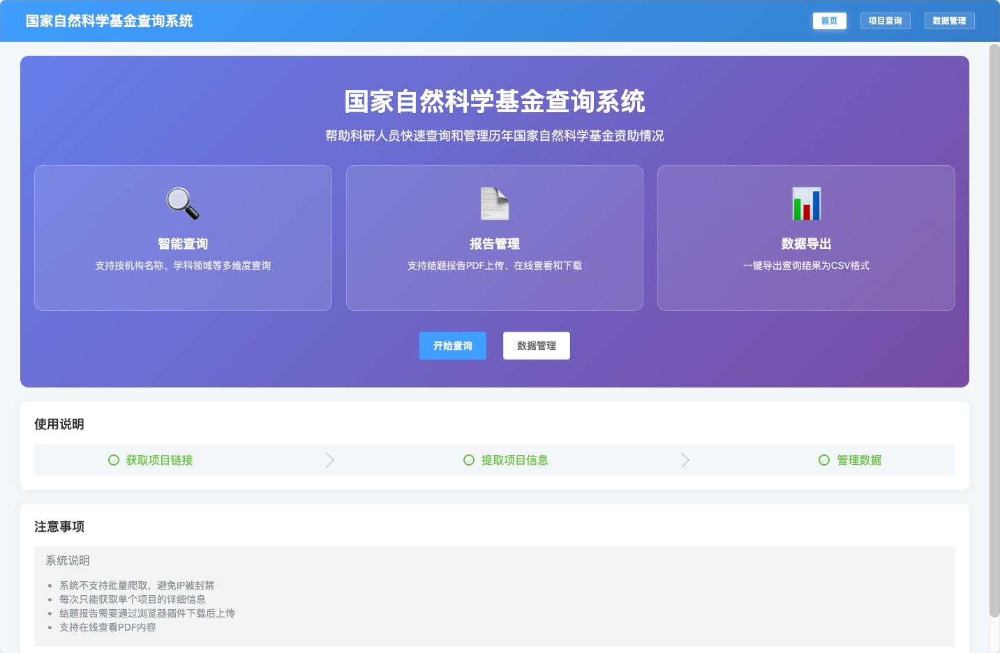
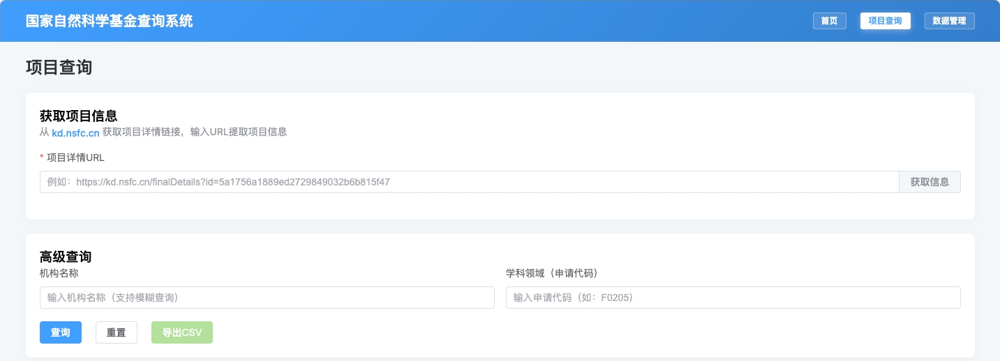
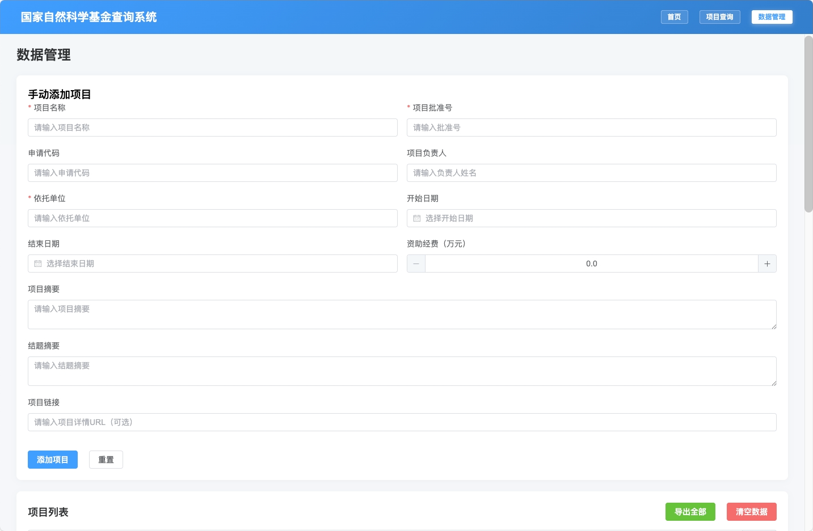

# NSFC-DMS - 国家自然科学基金数据管理系统

<div align="center">


**国家自然科学基金数据管理系统** - 为科研人员提供高效的基金项目管理与数据分析平台

</div>

## 📖 项目简介

NSFC-DMS 是一个基于国家自然科学基金（NSFC）数据的智能管理系统，旨在帮助科研人员：
- 快速查询和管理历年基金项目数据
- 便捷地上传和管理结题报告
- 智能分析项目信息和资助情况
- 提供友好的数据可视化和导出功能





## ✨ 核心功能

### 🎯 项目查询
- **智能搜索**：支持按机构名称、学科领域（申请代码）进行模糊查询
- **数据导出**：一键导出查询结果为 CSV 格式
- **分页显示**：支持大量数据的高效浏览

### 📄 结题报告管理
- **PDF 上传**：自动重命名格式为 `申请代码_项目名称_项目批准号.pdf`
- **在线预览**：支持浏览器原生 PDF 预览，无需下载
- **文件下载**：支持中文文件名下载
- **大小限制**：支持最大 1000MB 的 PDF 文件

### 🔍 项目详情
- **双摘要显示**：同时显示项目摘要和结题摘要
- **完整信息**：展示项目批准号、申请代码、负责人、依托单位等
- **报告管理**：查看、下载、删除关联的结题报告

### 📊 数据管理
- **项目编辑**：支持修改项目基本信息
- **项目删除**：安全的项目删除机制
- **批量操作**：高效的数据管理界面

## 🚀 技术栈

### 后端
- **框架**：Flask 2.x
- **数据库**：SQLite
- **PDF 处理**：PyPDF2 (fitz)
- **网络爬虫**：Selenium + Edge 浏览器
- **数据处理**：BeautifulSoup4

### 前端
- **框架**：Vue.js 3.x
- **UI 组件**：Element Plus
- **构建工具**：Vite
- **HTTP 客户端**：Axios

### 开发工具
- **版本控制**：Git
- **包管理**：npm / pip
- **代码编辑器**：VS Code

## 📁 项目结构

```
gzr/
├── backend/                    # 后端服务
│   ├── app.py                 # Flask 主程序
│   ├── requirements.txt       # Python 依赖
│   ├── nsfc.db               # SQLite 数据库
│   ├── uploads/              # PDF 文件存储目录
│   └── pachong_demo/         # 爬虫演示代码
├── frontend/                  # 前端应用
│   ├── src/
│   │   ├── App.vue          # 根组件
│   │   ├── main.js          # 入口文件
│   │   ├── router/          # 路由配置
│   │   ├── services/        # API 服务
│   │   └── views/           # 页面组件
│   ├── package.json         # 项目配置
│   └── vite.config.js       # 构建配置
├── .gitignore               # Git 忽略文件
└── README.md               # 项目说明
```

## 🛠️ 快速开始

### 环境要求
- Python 3.8+
- Node.js 16+
- Microsoft Edge 浏览器（用于爬虫）

### 后端部署

1. **安装依赖**
```bash
cd backend
pip install -r requirements.txt
```

2. **启动服务**
```bash
python app.py
```
服务将在 `http://localhost:5002` 启动

### 前端部署

1. **安装依赖**
```bash
cd frontend
npm install
```

2. **启动开发服务器**
```bash
npm run dev
```
应用将在 `http://localhost:3001` 可访问

## 🔧 核心功能详解

### 1. 项目查询流程
```
用户输入查询条件 → 后端调用 NSFC API → 数据解析 → 返回前端展示 → 支持导出 CSV
```

### 2. PDF 上传流程
```
选择 PDF 文件 → 自动提取项目信息 → 生成标准文件名 → 保存到 uploads 目录 → 记录到数据库
```

### 3. PDF 预览机制
```
点击预览 → 调用 /api/pdf/preview/{id} → Flask send_file → 浏览器原生渲染
```

## 📊 数据库设计

### 核心表结构

**projects 表**
```sql
id              TEXT    # 项目ID
title           TEXT    # 项目名称
approval_number TEXT    # 项目批准号
application_code TEXT   # 申请代码
leader          TEXT    # 项目负责人
unit            TEXT    # 依托单位
start_date      TEXT    # 开始日期
end_date        TEXT    # 结束日期
funding         REAL    # 资助经费
abstract        TEXT    # 项目摘要
conclusion_abstract TEXT # 结题摘要
url             TEXT    # 项目链接
created_at      TIMESTAMP
```

**reports 表**
```sql
id              TEXT    # 报告ID
project_id      TEXT    # 项目ID（外键）
filename        TEXT    # 文件名
file_path       TEXT    # 文件路径
file_size       INTEGER # 文件大小
upload_date     TIMESTAMP
```

## 🎯 API 接口

### 项目相关
- `POST /api/projects/fetch` - 获取项目信息
- `GET /api/projects` - 查询项目列表
- `GET /api/projects/{id}` - 获取项目详情
- `PUT /api/projects/{id}` - 更新项目
- `DELETE /api/projects/{id}` - 删除项目

### 报告相关
- `POST /api/reports/upload` - 上传报告
- `GET /api/reports/{id}/view` - 查看报告内容
- `GET /api/reports/{id}/download` - 下载报告
- `GET /api/pdf/preview/{id}` - PDF 预览
- `DELETE /api/reports/{id}` - 删除报告

### 数据导出
- `GET /api/export/projects` - 导出项目列表为 CSV

## 🔒 安全特性

- **文件类型验证**：仅允许 PDF 格式上传
- **文件名清理**：自动移除非法字符
- **大小限制**：1000MB 上传限制
- **路径安全**：防止目录遍历攻击
- **SQL 注入防护**：使用参数化查询

## 📈 性能优化

- **分页查询**：大数据量高效处理
- **异步上传**：支持大文件上传
- **缓存机制**：减少重复 API 调用
- **懒加载**：前端组件按需加载

## 🌐 浏览器兼容性

- ✅ Chrome 90+
- ✅ Edge 90+
- ✅ Firefox 88+
- ✅ Safari 14+

## 🤝 贡献指南

1. Fork 本仓库
2. 创建特性分支 (`git checkout -b feature/AmazingFeature`)
3. 提交更改 (`git commit -m 'Add some AmazingFeature'`)
4. 推送到分支 (`git push origin feature/AmazingFeature`)
5. 开启 Pull Request

## 📄 许可证

本项目采用 MIT 许可证 - 查看 [LICENSE](LICENSE) 文件了解详情

## 🙏 致谢

- [Flask](https://flask.palletsprojects.com/) - 后端 Web 框架
- [Vue.js](https://vuejs.org/) - 前端框架
- [Element Plus](https://element-plus.org/) - UI 组件库
- [National Natural Science Foundation of China](https://kd.nsfc.cn/) - 数据源

---

<div align="center">

**NSFC-DMS** © 2024  
Made with ❤️ for researchers

</div>
